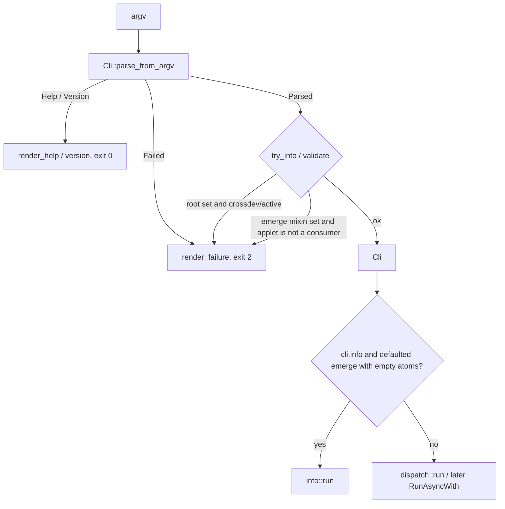
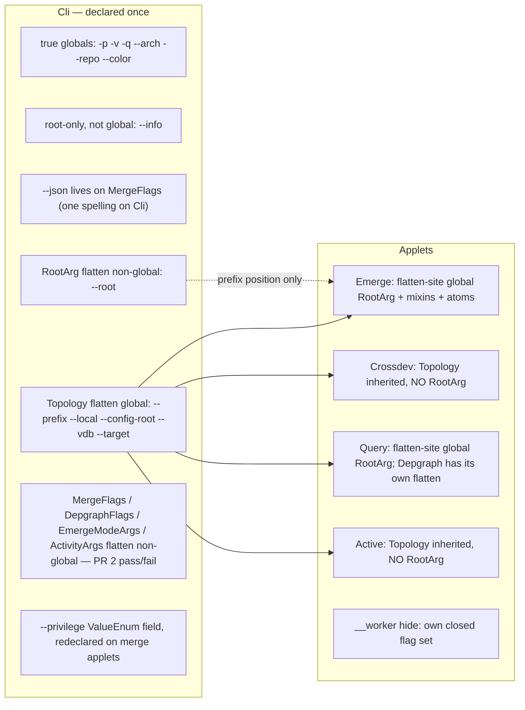

# Adopt usage-rs as `em`'s CLI framework

| Field | Value |
|---|---|
| Status | Draft |
| Date | 2026-09-03 |
| Author | Luca Barbato / design loop |
| Scope | `portage-cli` (`em`) only |
| Non-scope | `portage-repo` ebuild helpers, `portage-bench`, business logic in `portage-*` |

This is a **migration + leverage plan**, not a derive-macro swap. The goal is
to use what usage-rs 6 actually provides that `em` benefits from — parser,
dispatch, help, spec, completions, tests — and to delete `parse_cli_from`.

---

## Overview

`em` is a clap 4 derive CLI (`portage-cli/src/cli.rs` plus mixins in
`portage-cli/src/cli/{topology,merge_flags,depgraph_flags,emerge_mode,activity}.rs`).
The documented invocation is:

```text
em [applet] [options] [args]
```

No applet means emerge (`em --prefix P firefox`). Nested subcommands sit in
the path, then options, then positionals (`em query depgraph --root R zlib`,
`em active set --prefix P`).

clap cannot express a default subcommand, so `parse_cli_from` retries argv
with a leading `emerge`. Topology cannot live on `Cli` because clap
`global = true` would cascade `--root` into `crossdev`. Mixin `long_about`
clobbers applet `--help`. `--local` is `num_args = 0..=1` and steals `set`.

usage-rs 6 (facade `usage = { package = "usage-rs", version = "6" }`; host
CLI 6.2.0) has `default_subcommand`, first-class `global` / `flatten` /
`flagset`, `default_missing`, `hide`, `note`/`warning`/`example`/`effect`,
`Cli::to_kdl()`, completions, and `RunAsyncWith<Ctx>`.

Conversation-recorded spike results (prefix-on-applets vs prefix-global vs
`args_conflicts_with_subcommands`) are the evidence for default_subcommand
and Topology-as-root-global. The on-disk crate at `/tmp/em-usage-spike`
currently encodes **only** the args_conflicts + redeclared-`--prefix`
matrix; it never flattened the same `Args` type onto parent and child.
PR 2 checks all three variants back in as a runnable twin, including that
flatten — dual-mount is a **PR 2 pass/fail**, not a settled derive trick.

**The migration is layered, not applet-by-applet inside one binary** (one
`Cli` enum cannot be half clap). Independent PRs: isolate hidden applets,
lock the grammar in a test-only spike, swap the derive layer, then adopt
help/spec/completions/dispatch. Dual clap+usage in production is a non-goal.
Do not start the parser-swap PR until the spike twin is green.

---

## Background & Motivation

### Current parser

`Cli` (`portage-cli/src/cli.rs`) is `#[derive(Parser)]` with
`arg_required_else_help`, custom clap styles, and `applet: Option<Applet>`.
True globals on `Cli` today: `-p`/`--pretend`, `-v` (count), `-q`, `--arch`,
`--repo`, `--color` via `colorchoice_clap::Color`. `--info` and `--json`
are root-only (not `global`). Everything else is flattened onto applets.

`main.rs` calls `parse_cli_from(std::env::args_os())`, then
`cli.color.write_global()`, `diag::init`, `privilege::maybe_supervise`,
and `dispatch::run`. Dispatch is a hand-written `match` on `Applet`
(`portage-cli/src/dispatch.rs`).

~29 top-level applets (Helper, Worker, Ebuild, Maint, Portageq, Sync,
Depclean, Regen, Quickpkg, MirrorDist, Query, Clean, Use, Pkg, Revdep,
Read, Log, Grep, Search, Atom, Select, Active, Setup, Crossdev, Toolchain,
Stages, Etc, Env, Emerge), plus nested enums (`QueryCommand`,
`MaintCommand`, `SelectCommand`, …).

### Pain this migration exists to kill

1. **`parse_cli_from`** (`cli.rs`). Retries argv with a leading `emerge` so
   `em --root R cat/pkg` ≡ `em emerge --root R cat/pkg`. Help/version is not
   retried; a sibling applet in argv is left as a parse error. Exists
   because clap has no `default_subcommand`. It also walks `Cli::command()`
   to know which flags take values, so it will not treat `em -X search -p
   zlib` as the `search` applet.

2. **Topology mixin is flattened onto every applet, never onto `Cli`**
   (`cli/topology.rs` module doc). clap `global = true` on the root would
   cascade `--root` into `crossdev`. `CrossdevArgs` has no `RootArg`;
   `--root` is a clap parse error in any position. `Active` also omits
   `RootArg` (never registerable). Nested `em query depgraph --root R`
   works because each applet's `RootArg` field is itself `global = true`,
   cascading only inside that applet's subtree.

3. **`--local` is `num_args = 0..=1` with `default_missing_value = ""`**.
   `em active --local set` steals `set` as the path. Documented trap: put
   `set` first (`em active set --local=`).

4. **Flatten mixins last-one-wins `long_about`**. A second `///` paragraph
   on `RootArg` or `CleanOpts` becomes clap `long_about` and clobbers the
   flattening applet's `--help`. Merge-flag walls then repeat on every
   merge-shaped applet.

### Live usage-rs 6 spike (empirical; do not re-litigate without new evidence)

Conversation-recorded results against usage-rs 6 (re-run as PR 2 variants;
the throwaway `/tmp/em-usage-spike/src/main.rs` as of this writing only
contains the third matrix):

- `#[usage(default_subcommand = "emerge")]` + `--prefix` **only on applets**
  + `-p` **global on root**:
  - `em firefox` → emerge
  - `em emerge --prefix /p firefox` → emerge with prefix
  - `em toolchain --prefix /p --setup` → toolchain
  - `em --prefix /p toolchain --setup` → `UnknownFlag` (prefix not in root scope)
  - `em -p toolchain --setup` → toolchain, pretend
  - `em --prefix /p firefox` → `UnknownFlag` (emerge flags **not hoisted** to root)

- `--prefix` **global on root** (a **root field** with `global`, not a
  flattened `Topology` struct): all of the above succeed, **including**
  `em --prefix /p toolchain --setup`.

- `args_conflicts_with_subcommands` + prefix on root (non-global) + prefix
  **redeclared** as a second field on toolchain (this is what the on-disk
  crate actually compiles): rejects `em --prefix /p toolchain` **and**
  `em -p toolchain` (too coarse). **Do not use it.**

Not yet evidenced (PR 2 must produce the argv that proves each):

- Flattening the **same** `MergeFlags` / `RootArg` `Args` type onto `Cli`
  and a child.
- `#[usage(flatten, global)]` of a `Topology`-shaped struct (inner fields
  with or without `global`) onto `Cli`, vs a bare `--prefix` field.
- Flatten-site `#[usage(flatten, global)]` of `RootArg` (inner field
  **without** `global`) cascading into `QueryCommand` without making the
  `Cli` copy a root global.

**Settled user decision:** we already use mixins everywhere, so a global
mixin on the root is the same `Topology` flatten, not a new flag class.
Mount `Topology` **once** on the root with `#[usage(global)]`; omit
`RootArg` on `crossdev` (and `active`). Canonical docs stay
`em [applet] [options] [args]`; the parser may be as lenient as a root
global (`em --prefix P toolchain` would parse, like `em -p toolchain`).
`parse_cli_from` goes away.

The spike's other finding is load-bearing for the rest of this document:
**`default_subcommand` does not hoist the default command's flags into
prefix position.** `em --prefix P firefox` works only because Topology
will be a root global, not because emerge is the default. The same law
applies to `--root`, `-uD`, `-j`, `--privilege`, emerge-mode `-s`/`-C`,
and every other emerge flag used as `em <flags> <atoms>`.

---

## Goals & Non-Goals

### Goals

- Delete `parse_cli_from` and the value-taking-flag walk — **only if PR 2's
  same-type flatten compiles.** If it does not, stop; do not swap (Alternative C).
- Default applet is emerge, via `#[usage(default_subcommand = "emerge")]`.
- Topology is declared once, global on `Cli`.
- `em crossdev --root R` remains a parse error.
- `--help` / `--version` are never rewritten into emerge.
- Adopt usage-rs help, spec, completions, and test helpers — not just parsing.
- Preserve the invocation tests listed under Testing.
- MSRV 1.95, MIT, no GPL shell embedded, no `todo/` citations in rustdoc.

### Non-goals

- Rewriting business logic in `portage-*` crates.
- Dual clap+usage in the `em` binary, even behind a feature flag.
- Generating `docs/user/*.md` how-tos from the spec (a generated *reference*
  is in scope; how-tos stay hand-written).
- Replacing clap in `portage-repo` ebuild helpers (`doins`, `econf`, …) or
  in `portage-bench`. Workspace `clap` stays for those.
- `usage mcp` as a product surface (defer).
- `external_subcommand` (atoms are emerge positionals, not forwarded programs).
- `args_conflicts_with_subcommands` (spike: breaks `em -p toolchain`).

---

## Key Decisions

1. **`default_subcommand = "emerge"` replaces `parse_cli_from` for positional
   routing.** `em firefox` is emerge. Help/version are native. Sibling
   applets are not rewritten. Flag hoisting is *not* included; Topology
   (Decision 2) and the PR 2 pass/fail for RootArg/MergeFlags (Decisions
   3–4) are what recover `em --prefix P firefox` / `em -uD @world`.

2. **`Topology` is mounted once on `Cli` with `#[usage(flatten, global)]`.**
   `--prefix`/`--local`/`--config-root`/`--vdb`/`--target` work before or
   after any applet, including `em --prefix P toolchain`. Per-applet
   Topology copies go away. `Cli::roots()` reads `self.topology`.

3. **`RootArg` is *not* a root global, and `global` does not live on the
   inner field.** Today `RootArg.root` is `global = true` inside the mixin
   (`cli/topology.rs`); flattening that type onto `Cli` would make `--root`
   a root global and collide with `__worker --root`. Target shape, spike
   as its own compile in PR 2:
   - inner field **without** `global`;
   - `#[usage(flatten)]` on `Cli` (prefix `em --root R firefox` only);
   - `#[usage(flatten, global)]` on Emerge/Query/… so `--root` cascades
     into `em query depgraph --root R zlib`;
   - no `RootArg` on Crossdev, Active, or Worker.
   `em crossdev --root R` stays an unknown flag. `em --root R crossdev`
   binds the Cli copy then selects crossdev — a `try_into` / portable
   `validate` failure (exit 2), not a hand-built `usage::Error`. If
   flatten-site `global` does not cascade into `QueryCommand`, **stop
   dual-mounting the type**: raw non-global `root: Option<String>` on
   `Cli`, keep `RootArg` (field-global) only on applets.

4. **Prefix-position emerge flags need mixins on `Cli`. Dual-mount of the
   same `Args` type onto parent and child is a PR 2 pass/fail, not a
   settled decision.** `em -uD @world` and `em emerge -uD @world` both
   have to work without making `-a`/`-s`/`-n` global (those collide with
   `em use`). The candidate shape is a non-global flatten of
   `MergeFlags`/`DepgraphFlags`/`EmergeModeArgs`/`ActivityArgs` on `Cli`
   plus the same types on the merge-shaped applets. `--privilege` is a
   `ValueEnum` **field** on `Cli` and on those applets (redeclare, not
   `flatten` — see Privilege). PR 2 must flatten those **real** `Args`
   types (not a redeclared `--prefix` field) and assert `em use -a png`,
   `em search -a`, `em emerge -a pkg`, `em __worker --root`, one `--json`
   on the root, and `to_kdl()` unique-flags in one compile. Quote the
   proving argv in the PR body. **Do not start PR 4 until that binary is
   green.** If it does not compile, stop; do not swap (see Alternative C).
   Overlay, if it lands: bools OR, `Option` prefers applet `Some` else
   Cli, `Vec` applet-wins (no concatenate). Prefix emerge-mixin flags
   before a **non-merge** applet (`em -uD query …`, `em -a search`) are a
   `try_into` reject, not silently ignored. Query depgraph keeps its own
   flatten; Cli overlay does not feed it.

   **One `--json` on the root.** Today clap dual-mounts a raw `Cli.json`
   plus `MergeFlags.json` on applets — that works only because MergeFlags
   is *not* flattened onto `Cli`. Flattening MergeFlags while keeping
   `pub json: bool` on `Cli` is two `--json` on the same command and
   fails unique-flags for the wrong reason. **Drop `Cli.json`.** Prefix
   `em --json` / `em --info --json` bind `Cli.merge_flags.json`.
   `em emerge --json` binds the applet copy; overlay ORs the two
   `MergeFlags.json` fields. Retarget `cli.json` call sites (`info.rs`
   already ORs both). Do not strip `json` from `MergeFlags` (that would
   need a second copy on every merge applet again).

5. **`unknown_flags = "error"` on the root.** `em` owns its flags. No
   wrapper applet wants `value`. `__helper` uses `allow_hyphen_values` on
   its trailing positional, which is values, not unknown flags.

6. **`args_conflicts_with_subcommands`: do not use.** Spike evidence.

7. **`--local` uses `default_missing = ""`, not `require_equals`.** Detached
   `--local DIR` stays valid. The `em active --local set` trap stays:
   `--local` consumes `set` as `DIR`, so `ActiveCommand::Set` is never
   selected. Put `warning` on `Applet::Active` and/or Topology `--local`
   (the pages the broken invocation can still reach). Keep the rustdoc on
   `Set`. Optional `try_into`: `local == Some("set")` ∧ applet is Active ∧
   command is None → fail with the documented hint.

8. **Env fallbacks are read once in selectors, never `env =` on a
   dual-mounted field.** `ROOT` stays in `resolved_root`. `EM_PRIVILEGE`
   is read once in `effective_privilege()` (argv on either copy wins over
   the env; do not let a child's env-default `Sudo` beat a prefix
   `--privilege none`). `EM_EMERGELOG` is read once in
   `effective_activity()`. Strip `env` from the mixin structs.

9. **`--arch` is `FromStr` + `default_fn = Arch::current`, not `ValueEnum`.**
   `Arch` accepts exotic keywords (`FromStr::Err = Infallible`). A closed
   enum would reject them. `Privilege` and `DepgraphFormat` *are*
   `ValueEnum`; `Privilege`'s cfg-gated variants stay gated.

10. **`--color` is a local `ColorChoice` ValueEnum**, mapped to
    `colorchoice::ColorChoice::write_global()` (what `anstream` already
    honours). Drop `colorchoice-clap`. usage help colour is separate
    (`NO_COLOR` / `CLICOLOR_FORCE`).

11. **Hidden `__helper` / `__worker` stay `hide`, and colliding worker flags
    are isolated before Topology becomes global.** Worker today declares
    `--root`, `--config-root`, `--quiet` — the last already overlaps a
    true global; `--config-root` would overlap Topology. Isolation is PR 1,
    not an afterthought.

12. **Dispatch stays a `match` through the parser swap.** `RunAsyncWith<&Cli>`
    is a later PR. One generated match is the end state; it is not the
    first merge.

13. **Generated markdown is a *reference* tree under `docs/user/cli/`, not a
    replacement for `docs/user/*.md` how-tos.** Hidden applets must not
    appear. `usage mcp` is deferred.

14. **clap remains in the workspace** for `portage-repo` helpers and
    `portage-bench`. Only `portage-cli` drops it.

---

## Proposed Design

### Target grammar



`__usage_spec__` / `__complete_word__` are intercepted in `main` **before**
parse, and only from the completions PR (PR 6). They are not part of the
parser-swap binary.

Documented form stays `em [applet] [options] [args]`. The parser additionally
accepts **true globals and Topology** before a named applet (settled).
Prefix-position **emerge mixins** (`-uD`, `-a`, `--privilege`, …) are for
the default emerge path (`em -uD @world`). Before a non-merge applet they
are a `try_into` reject, not bound-and-ignored.

| Invocation | Result |
|---|---|
| `em firefox` | emerge, atoms=`[firefox]` |
| `em emerge --prefix /p firefox` | emerge, prefix |
| `em --prefix /p firefox` | emerge, prefix (Topology global) |
| `em --prefix /p toolchain --setup` | toolchain (lenient; allowed) |
| `em toolchain --prefix /p --setup` | toolchain (canonical) |
| `em -p toolchain --setup` | toolchain, pretend |
| `em toolchain -p --setup` | toolchain, pretend |
| `em --root R firefox` | emerge, root (Cli non-global RootArg) |
| `em query depgraph --root R zlib` | query (applet flatten-site global RootArg) |
| `em --deep query depgraph zlib` | `try_into` reject (Cli DepgraphFlags, query is not a merge applet) |
| `em query depgraph --deep zlib` | query depgraph, its own flatten |
| `em crossdev --root R --setup` | parse error (no RootArg on crossdev, not global) |
| `em --root R crossdev --setup` | `try_into` failure, exit 2 |
| `em -uD query belongs /usr/bin/python` | `try_into` reject |
| `em -a search` | `try_into` reject (`--ask` then a non-merge applet) |
| `em search -a` | search `--all` |
| `em use -a png` | use `--add` |
| `em --help` | **root** help, not emerge |
| `em toolchain --help` | toolchain help |
| `em --version` | version, not emerge |
| `em --info` | `info::run` (see `--info` below) |
| `em --info use` | **use** (info does not steal a named applet) |
| `em --info firefox` | spike-lock; see `--info` below |
| `em` | root help, exit 2 (`arg_required_else_help`) |
| `em -p` | “no atoms or applet specified” (or emerge empty-atom equivalent) |



### `Cli` shape (illustrative)

```rust
#[derive(usage::Cli, Debug)]
#[usage(
    bin = "em",
    version,
    about = "Gentoo Portage package manager workalike",
    arg_required_else_help,
    unknown_flags = "error",
    default_subcommand = "emerge",
    // no `completion` until PR 6 — parse_from_argv does not intercept
    // __complete_word__ / __usage_spec__, and those words must not become
    // emerge atoms.
)]
pub struct Cli {
    #[usage(long, global, value_enum, default = "auto", value_name = "WHEN")]
    pub color: ColorChoice,

    #[usage(short = 'p', long, global)]
    pub pretend: bool,

    /// emerge --info workalike. Takes no atoms.
    #[usage(long)]
    pub info: bool,

    // No `pub json: bool` here. `--json` is MergeFlags.json; flattening
    // MergeFlags onto Cli plus a raw field is two `--json` on one command.

    #[usage(short = 'v', long, count, global)]
    pub verbose: u8,

    #[usage(short = 'q', long, global)]
    pub quiet: bool,

    #[usage(
        long,
        global,
        value_name = "ARCH",
        default_fn = default_arch,
        default_note = "current system architecture"
    )]
    pub arch: Arch,

    #[usage(long, global, value_name = "PATH")]
    pub repo: Option<String>,

    // PR 2: flatten a Topology-shaped struct whose inner fields are `global`
    // (or `#[usage(flatten, global)]` if inner fields are non-global). Assert
    // `em --prefix P toolchain` and `em query depgraph --prefix P zlib`.
    #[usage(flatten, global)]
    pub topology: Topology,

    /// Prefix-position `--root` for default emerge. Inner field is *not*
    /// `global`; this flatten is not `global` either. Must not leak into
    /// crossdev/active/worker.
    #[usage(flatten)]
    pub root_arg: RootArg,

    #[usage(flatten)]
    pub merge_flags: MergeFlags,
    #[usage(flatten)]
    pub depgraph_flags: DepgraphFlags,
    #[usage(flatten)]
    pub mode: EmergeModeArgs,
    #[usage(flatten)]
    pub activity: ActivityArgs,

    /// ValueEnum field, not a flatten. Same field is redeclared on merge
    /// applets (PR 2 unique-flags for that redeclare, separate from the
    /// MergeFlags/RootArg flatten compile). No `env`.
    #[usage(long, value_enum, default = "auto")]
    pub privilege: Privilege,

    #[usage(subcommand)]
    pub applet: Option<Applet>,
}

fn default_arch() -> Arch {
    Arch::current()
}
```

Drop `cli_styles()`. usage picks terminal styles itself and honours
`NO_COLOR`. Do not port clap's `Styles` palette.

### `parse_cli_from` replacement

There is no argv rewriter. Cross-field rejects cannot be stuffed into a
hand-built `usage::Error` (`Error` is `#[non_exhaustive]` and produced by
the parser; there is no documented constructor for “pretend this successful
parse was `UnknownFlag --root`”). A `bail!` after parse is a **run** error,
not exit 2 with clap-shaped diagnostics — tests and `CrossdevArgs`'s doc
expect a **parse** error.

**Commit to usage `try_into` / portable `validate` on `Cli`.** usage
`embedded_outcome_into` already renders a rejected conversion as a parse
failure. The conversion fails when:

1. Cli `root_arg` is set ∧ applet is `Crossdev` or `Active`.
2. Any non-default Cli-level `MergeFlags` / `DepgraphFlags` /
   `EmergeModeArgs` / `ActivityArgs`, or a non-`Auto` Cli `--privilege`,
   ∧ the selected applet does not consume that mixin/field (defaulted
   emerge *does*). `--privilege` is a redeclared field, not a flattened
   mixin.
3. Optional: `topology.local == Some("set")` ∧ applet is Active ∧ command
   is None (the `--local set` trap).

`main.rs` uses `parse_from_argv` then `try_into` (or
`Cli::embedded_outcome_into` in tests) and handles `Error::Help` /
`Error::Version` / failures with `Cli::render_help` / `render_failure`
(help stdout exit 0, failure stderr exit 2). Completions and
`__usage_spec__` are **not** wired until PR 6.

If `try_into` cannot say `unexpected argument '--root'`, PR 2 spikes the
actual stderr and the parser-swap tests lock *that* text. Do not invent a
`usage::Error` variant.

No `with_leading_emerge`, no `known_subcommand_token`, no
`value_taking_flags`. Those functions delete in the parser-swap PR — and
they stay deleted. A rewriter that does not know value-taking flags cannot
preserve `em -X search -p zlib`.

### `--info` / `--json`

`--info` stays a **raw, non-global** field on `Cli` (clap today: no
`global = true`). Making it global would advertise it on `query`/`use`/etc.

`--json` is **not** a second raw field. It lives on `MergeFlags` only.
Prefix `em --json` / `em --info --json` bind `Cli.merge_flags.json` because
MergeFlags is flattened onto `Cli`. `em emerge --json` binds the applet
copy. Overlay ORs the two `MergeFlags.json` bools. Drop `Cli.json` and the
`flags.json |= self.json` line; retarget `info.rs` (`cli.json ||
cli.merge_flags().json`) to `cli.merge_flags().json`. Do not make `--json`
`global`.

Today `em --info` is `applet: None` and only the `None` arm of
`dispatch::run` consults `cli.info`. So `em --info use` **runs use**.
Unconditional “check `cli.info` first” would steal every applet. Do not.

**Dispatch rule:** run `info::run` only when `cli.info` is set **and** the
selected command is defaulted emerge with empty atoms (or `applet` is still
`None`). Named applets always win. `em emerge --info` stays an unknown flag
(`--info` is not on `EmergeArgs` and not global).

PR 2 locks:

| argv | expect |
|---|---|
| `em --info` | `info::run`, stdout is info, exit 0 |
| `em --info --json` | info + json |
| `em emerge --info` | parse failure (unknown flag) |
| `em --info use` | **use**, not info |
| `em --info firefox` | spike: either unknown (`--info` then atoms on default emerge — `--info` is not on emerge) or info-and-drop-atoms. Prefer parse failure if default_subcommand leaves `--info` as a root flag and `firefox` as an emerge atom *without* treating the whole line as info. Lock whichever usage actually does; do not drop atoms into `info::run`. |
| `em` | root help, stderr, exit 2 |
| `em -p` | “no atoms or applet specified” (stderr), exit 1 — not root help, not info |

`arg_required_else_help` stays. Bare `em` must show **root** help. If the
spike shows emerge's page, set `arg_required_else_help` only on `EmergeArgs`
and render root help from the wrapper.

### Topology and `Cli::roots()`

Today `topology_and_root()` matches every applet to pick *that* applet's
copy (`cli.rs`). After Topology-once-on-Cli, Topology is `self.topology`.
RootArg is still per-applet (plus the Cli prefix-position copy). Inner
`RootArg.root` is **not** `global`; applet mounts use flatten-site
`#[usage(flatten, global)]`:

```rust
fn topology_and_root(&self) -> (Topology, RootArg) {
    let topology = self.topology.clone();
    let root = match &self.applet {
        Some(Applet::Crossdev(_)) | Some(Applet::Active { .. }) | None => {
            self.root_arg.clone() // None: default emerge prefix-position --root
        }
        Some(Applet::Emerge(a)) => overlay_root(&a.root_arg, &self.root_arg),
        Some(Applet::Query { root_arg, .. }) => overlay_root(root_arg, &self.root_arg),
        // … every Roots-consuming applet
        _ => RootArg::default(),
    };
    (topology, root)
}

fn overlay_root(applet: &RootArg, cli: &RootArg) -> RootArg {
    RootArg { root: applet.root.clone().or_else(|| cli.root.clone()) }
}
```

`None` after default_subcommand should be rare (only `--info` / empty help
paths). Prefer reading emerge's RootArg when the defaulted variant is
present.

`resolved_root` stays the single `ROOT` env site:

```rust
pub fn resolved_root(root: &RootArg) -> Option<String> {
    root.root.clone().or_else(|| std::env::var("ROOT").ok())
}
```

Do **not** add `env = "ROOT"` on the field. Dual-mount plus env would
apply the fallback on both copies independently; the current comment on
`RootArg` exists to prevent that.

### `--local`

```rust
#[usage(long, global, default_missing = "", value_name = "DIR")]
pub local: Option<String>,
```

Semantics stay: `Some("")` → `~/.gentoo`; `Some(path)` → that path;
`None` → not requested. Do **not** add `require_equals`: that would break
every `--local DIR` test (`local_with_path_uses_dir_directly`, active
registration, …).

Trap `em active --local set` remains: `--local` consumes `set` as `DIR`, so
`ActiveCommand::Set` is **not** selected (`command` stays `None` / Show).
A `warning` on `Set` only renders on `em active set --help`, which already
works. Put it where the broken invocation can still see it:

```rust
// on Applet::Active, and/or on Topology.local
#[usage(warning = "em active --local set steals set as the directory. \
                   Put the subcommand first: em active set --local=")]
```

Keep the rustdoc on `Set`. Optional `try_into` (Decision 7) fails that
invocation with the same hint. Do not try `subcommand_precedence_over_arg`
as the first-pass fix (it ends a *variadic* value owner).

### Mixin flatten / flagset

usage `#[usage(flatten)]` emits a spec `flagset` named after the struct and
a `use` on every command that flattens it. That is the portable identity of
"declare once": docs, manpages, and completions see the same flags without
copy-paste.

| Mixin | Mount | `global` | Notes |
|---|---|---|---|
| `Topology` | `Cli` only | inner fields `global`, or flatten-site `global` | Settled. PR 2 flattens the struct, not a bare `--prefix` field. |
| `RootArg` | `Cli` (`flatten`, **not** global) + Roots applets except crossdev/active/worker (`flatten, global`) | **not** on the inner field | PR 2 pass/fail. See Decision 3. |
| `MergeFlags` | `Cli` (non-global) + Emerge, Crossdev, Toolchain, Stages, Setup, Revdep, Depclean | no | PR 2 pass/fail. **Not** mounted to feed query. `-a` must not reach `use`/`search`. Carries the **only** `--json` on the root (no raw `Cli.json`). |
| `DepgraphFlags` | `Cli` (non-global) + merge applets only | no | `QueryCommand::Depgraph` keeps its **own** flatten. Cli overlay does not reach it. Prefix `em --deep query depgraph zlib` is a `try_into` reject. |
| `EmergeModeArgs` | `Cli` (non-global) + `EmergeArgs` only | no | `-s`/`-C`/`-c` are emerge actions |
| `ActivityArgs` | `Cli` (non-global) + Emerge, Regen, Crossdev, Toolchain, Stages, Setup | no | No `env` on the field |
| `--privilege` | `ValueEnum` **field** on `Cli` + Emerge, Crossdev, Toolchain, Stages, Setup | no | Redeclare, not `flatten`. No `env`. PR 2 unique-flags this separately. |
| `CleanOpts` | `CleanTarget` variants only | no | One `///` paragraph; usage flatten does not clobber `long_about` |
| `EtcOpts` | `Etc` only | no | `conflicts` stay |

`QueryCommand::Depgraph` also **redeclares** MergeFlags-shaped shorts
(`-e`/`--emptytree`, `-o`/`--onlydeps`, `--with-bdeps`, `--root-deps`).
Those stay on the query variant. They are a unique-flags risk if parent
non-globals leak into the child table (the same PR 2 compile that kills
or saves dual-mount).

A flattened struct **must not** declare subcommands (usage compile error).
Keep nested commands as enums on the parent (`Query.command`,
`Maint.command`, …).

`heading("Roots", help = "…")` / `heading("Merge", …)` on the mixin types
puts unheaded flags under a section at every mount. That is the unslop
for merge-flag walls, in the help PR, not the parser swap.

### Overlay of dual-mounted mixins

Only if PR 2's same-type flatten compiles. `Cli::merge_flags` today picks
the applet copy and does `flags.json |= self.json`. After dual-mount there
is no `Cli.json`; overlay **applet-wins for `Vec`** (matches `overlay_root`;
no concatenate) and OR for `MergeFlags.json`:

```rust
fn overlay_merge(cli: &MergeFlags, applet: &MergeFlags) -> MergeFlags {
    MergeFlags {
        ask: cli.ask || applet.ask,
        update: cli.update || applet.update,
        // … every bool: OR
        jobs: applet.jobs.or(cli.jobs),
        load_average: applet.load_average.or(cli.load_average),
        exclude: if applet.exclude.is_empty() {
            cli.exclude.clone()
        } else {
            applet.exclude.clone()
        },
        json: cli.json || applet.json, // both are MergeFlags.json
        // …
    }
}
```

Unit-test `em -X foo emerge -X bar pkg` (exclude is `bar`, applet wins) and
`em -u emerge -D pkg` (bools OR). No `flags.json |= self.json` — that line
existed to fold the raw `Cli.json` field, which is gone.

`Cli::depgraph_flags()` today only matches Emerge/Crossdev/Toolchain/
Stages/Setup. **Do not extend it to query.** `em query depgraph --deep`
reads `QueryCommand::Depgraph`'s own flatten. Prefix `em --deep query
depgraph zlib` is rejected by `try_into` (query is not a merge-shaped
consumer of the Cli copy).

`effective_privilege()` / `effective_activity()`: overlay the two copies
the same way (bools OR; Privilege: non-`Auto` **argv** on either copy
wins, else `Auto`), then apply **env once** (`EM_PRIVILEGE` /
`EM_EMERGELOG`) if still default. Prefix `em --privilege none emerge pkg`
with `EM_PRIVILEGE=sudo` in the environment must stay `None`.

This *is* two copies. It is confined to these selectors — Topology is
**not** dual-mounted — and it is the price of prefix-position emerge flags
without global `-a`. If PR 2 does not compile, there is no overlay and no
parser swap (Alternative C).

### Privilege, Arch, color, DepgraphFormat

**`Privilege`** (`cli.rs`): `#[derive(usage::ValueEnum)]`, keep cfg-gated
variants (`fakeroost` / `pseudoroot` / `hakoniwa`). usage keeps cfg gates
in every generated metadata table. Field:

```rust
#[usage(long, value_enum, default = "auto")]
pub privilege: Privilege,
```

Today this sits on each merge-shaped applet with `env = "EM_PRIVILEGE"`.
Strip `env`. Declare the **same field** on `Cli` and on those applets
(redeclare, not `flatten` of a `ValueEnum` — that is a compile error).
Do not wrap it in a dummy `PrivilegeArg` unless PR 2 somehow needs a
flagset; it is not needed. PR 2 asserts unique-flags for that redeclare
separately from the `MergeFlags`/`RootArg` flatten compile.
`effective_privilege()` overlays the two `Privilege` values (non-`Auto`
**argv** on either copy wins, else `Auto`) then reads `EM_PRIVILEGE`
**once** (Decision 8). Same for `ActivityArgs.emergelog` /
`EM_EMERGELOG`.

**`Arch`**: not a ValueEnum. `gentoo-core::Arch::from_str` never fails
(unknown keywords become `Exotic`). Delete `parse_arch`. usage binds
`FromStr` whose error implements `Display`; `Infallible` is fine.
`default_fn = default_arch` with `default_note = "current system
architecture"` — the portable spec must not emit a host-dependent
`default="amd64"`.

**`ColorChoice`**: local enum `Auto | Always | Never`, `ValueEnum`, default
`auto`. `main.rs` maps to `colorchoice::ColorChoice` and calls
`write_global()`. Drop the `colorchoice-clap` dependency from
`portage-cli`. Keep the `colorchoice` crate if `anstream` does not already
pull it in for `write_global` — `anstream::ColorChoice` is what `diag.rs`
reads; set the global the same way clap's mixin did.

**`DepgraphFormat`**: `#[derive(usage::ValueEnum)]` (`pretty` / `json` /
`tree`).

### Hidden `__helper` / `__worker`

```rust
#[usage(name = "__helper", hide)]
Helper { name: String, #[usage(double_dash = "automatic", allow_hyphen_values)] args: Vec<String> },

#[usage(name = "__worker", hide)]
Worker(WorkerArgs),
```

`hide` removes them from help, docs, and completions. They still parse.
`privilege.rs` `build_worker_command` continues to spawn
`em __worker --ebuild … --root …`. PATH shims in `portage-repo` continue
to `exec em __helper <name> "$@"`.

**Collisions (must be fixed in PR 1, before Topology is global):**

| Worker flag | Overlaps | Replacement |
|---|---|---|
| `--quiet` | Cli global `-q`/`--quiet` | Drop the worker field; spawn still passes `--quiet` as that global. `dispatch.rs` `Applet::Worker` reads `globals.quiet` into `InstallWorker`. |
| `--config-root` | Topology global | Rename to `--worker-config-root` in `WorkerArgs`, `build_worker_command`, **and** `dispatch.rs` together. |
| `--root` | RootArg if it were a root global | Inner field is not `global`; Cli flatten is not `global`. Worker's required `--root` stays. Do not change this name. |

`to_kdl()` debug asserts unique flag spellings across a flatten boundary.
PR 1's isolation is what makes Topology-global in PR 4 compile. Extracting
`WorkerArgs` rewrites every field in the `dispatch.rs` match arm — PR 1
lists that file.

`__helper` trailing args: clap `trailing_var_arg + allow_hyphen_values`
maps to `double_dash = "automatic"` plus `allow_hyphen_values`. Preserve
hyphen-prefixed helper args (`em __helper dodoc -- -foo`).

### Unique flags

Today `every_subcommand_has_unique_flags` calls
`Cli::command().debug_assert()` (debug-only; this is how `-a` vs `em use
--add` shipped). Replacement:

```rust
#[test]
fn spec_is_valid() {
    // Prefer Cli::spec() if it already yields a parseable tree (no extra
    // crate). Otherwise pin `usage-lib` 6 as a *dev-dependency* under an
    // alias that does not collide with the `usage` facade. PR 2 spikes the
    // real type path; do not guess `usage_parser::Spec`.
    let _ = Cli::to_kdl();
    let _ = Cli::spec();
}
```

`to_kdl()` already asserts in debug builds: no duplicate keys, no duplicate
flag spellings across a flatten boundary, no unfillable argument after an
unbounded variadic. Keep a dedicated test that `em use -a png` parses as
add, not ask, and that `em emerge -a pkg` parses as ask.

### Short aliases (`visible_short_alias`)

`em use` / `em pkg use` advertise euse shorts: `-E` add, `-D` subtract,
`-R`/`-P` drop, on top of `-a`/`-s`/`-d`. Parity is `-E` as a **short
alias of `--add`**, not a second long. usage flags have a single `short`.
**Spike extra shorts first** (`alias = "-E"` / a second `short` /
`visible_alias`). Do not ship without `em use -E png`.

If sibling fields are required, do **not** invent public `--enable` /
`--disable`. Name the hidden long the same as the real one if usage
allows duplicate longs, or document the extra hidden spelling in the help
PR. Completions with `hide` must omit it.

Subcommand aliases stay hidden vs visible 1:1:

| clap today | usage |
|---|---|
| `query belongs` `alias = "b"` (hidden) | `alias` — must **not** list `b` on `em query --help` |
| `select repository` `visible_alias = "repos"` | `visible_alias` |
| `etc` `alias = "config"` / `"dispatch"` (hidden) | `alias` |

---

## Feature inventory (keep / adopt / defer)

### Parser / grammar

| Feature | Decision | Rationale |
|---|---|---|
| `default_subcommand = "emerge"` | **Adopt** | Deletes the positional half of `parse_cli_from`. |
| `unknown_flags = "error"` at root | **Adopt** | `em` owns its flags. No wrapper applet wants `value`. |
| `#[usage(global)]` true globals (`-p -v -q --arch --repo --color`) | **Keep as globals** | Already global; both orders work (`em -p toolchain`, `em toolchain -p`). |
| Topology mixin flattened onto `Cli` (inner `global` or flatten-site `global`) | **Adopt** | Settled. PR 2 uses the struct, not a bare `--prefix` field. |
| RootArg: inner field not `global`; Cli `flatten`; applets `flatten, global` | **PR 2 pass/fail** | Nested `--root` + prefix emerge + no leak into worker/crossdev. |
| `flatten` / emitted `flagset` + `use` for all mixins | **Adopt** | One declaration, portable spec. |
| `default_missing = ""` for `--local` | **Adopt** | Replaces clap `num_args = 0..=1` / `default_missing_value`. |
| `require_equals` on `--local` | **Do not use** | Would break `--local DIR`. |
| `args_conflicts_with_subcommands` | **Do not use** | Spike: rejects `em -p toolchain`. |
| `external_subcommand` | **Do not use** | Atoms are emerge positionals. |
| `subcommand_negates_reqs` | **Defer / unused** | No parent required flags that a child should drop. |
| `subcommand_precedence_over_arg` | **Defer** | Not the `--local set` fix; optional later experiment. |
| `ValueEnum` for Privilege, DepgraphFormat, ColorChoice | **Adopt** | Closed vocabularies. |
| `ValueEnum` for Arch | **Do not use** | Exotic keywords are valid. `FromStr` + `default_fn`. |
| `env = "ROOT"` on RootArg | **Do not use** | Keep `resolved_root`. |
| `env = "EM_PRIVILEGE"` / `EM_EMERGELOG` on mixin fields | **Do not use** | Read once in `effective_privilege` / `effective_activity`. Dual-mount + `env` is split-brain. |
| `hide` on `__helper` / `__worker` | **Adopt** | Must not appear in help, markdown, completions. |
| `count` for `-v` | **Adopt** | Replaces `ArgAction::Count`. |
| `double_dash = "automatic"` for helper/depclean trailing | **Adopt** | Replaces `trailing_var_arg`. |
| `conflicts` / `required_unless` | **Adopt** | `EtcOpts`, `Use` `list_expand`/`info`, `Search` pattern. |
| clap `Styles` / `cli_styles()` | **Drop** | usage styles itself. |
| clap `CommandFactory` / `debug_assert` | **Drop** | `to_kdl()` debug asserts + `spec_is_valid`. |
| `arg_required_else_help` | **Keep** | Bare `em` shows help. Verify *which* page in the spike. |

### Dispatch / structure

| Feature | Decision | Rationale |
|---|---|---|
| `#[usage(run_async_with)]` / `RunAsyncWith<&Cli>` | **Adopt, later PR** | Shared context is exactly `Cli` (globals, Roots, privilege, pretend). Parser swap keeps `dispatch.rs`. |
| Mixed sync/async (`#[usage(run)]` on atom/log/active/env) | **Adopt with dispatch PR** | usage supports mixing; `Output = anyhow::Result<()>`. |
| Enum nesting for query/active/select/clean/maint/log/etc | **Keep** | Flattened structs cannot declare subcommands. |
| Extract remaining inline variants to `Args` structs | **Adopt, PR 3** (after Worker extract in PR 1) | Needed for `Run*` impl types; also shrinks the swap diff. |
| `run_with_lazy` / `no_ctx` | **Defer** | Every applet already receives `&Cli`. |
| `Option` subcommand on root | **Keep** | `--info` / empty; generated dispatch cannot decide `None`. |

### Help, docs, completions

| Feature | Decision | Rationale |
|---|---|---|
| `Cli::to_kdl()` / `__usage_spec__` | **Adopt** | Portable identity. Answered before parse. |
| `usage generate markdown --multi` | **Adopt** | Reference pages under `docs/user/cli/`. How-tos stay hand-written. |
| `usage generate manpage` | **Adopt** | Ship `em.1` from the spec in a later docs PR; not a how-to. |
| Hidden applets in markdown | **Must not appear** | Native `hide`. Verify; clap_usage extract *did* leak them. Fallback: generate from a spec filtered to `hide!=true`. |
| Shell completions (`completions` feature, `Cli::completion_script`) | **Adopt** | No `clap_complete` today. New `em completion <shell>` applet. |
| `help_heading` / `heading(...)` on mixins | **Adopt** | Unslop merge-flag walls. |
| `next_line_help` (command-level) | **Adopt selectively** | `--info` wall of text: put the essay in `long_help` so `-h` stays short; do not enable next_line_help globally. |
| `flatten_help` | **Adopt on query, select, maint, clean** | Parent page shows child synopses. Not on root (too large). |
| `note` / `warning` | **Adopt** | `--local set` trap; `--keep-going` exists-for-parity (do not recommend it). |
| `example` on commands | **Adopt** | Documented invocation order as parsed examples (`usage lint` checks they still parse). |
| `effect` (`read`/`write`/`destructive`) | **Adopt** | Merge/setup/toolchain/stages = `write`; depclean/unmerge/clean = `destructive`; query/search/log/atom = `read`. `mirrordist` is `write` (command-level); `--delete` gets a `warning` unless PR 2 finds flag-level `effect`. `--pretend` does **not** lower effect (usage forbids lowering). |
| `output` / `exit_code` | **Adopt lightly** | Declare `em -p --json` / `em --info --json` as JSON outputs; `em query` pretty/json/tree. Do not annotate every applet. |
| `usage mcp` | **Defer** | No concrete `em` consumer. `effect` is what an agent would want first. |
| Completions `complete =` for atoms | **Defer** | Needs a repo to list packages; cold-path subprocess is fine later. `ValueHint::AnyPath` on `--prefix`/`--root`/`--local` in the completions PR. |

### Testing

| Feature | Decision | Rationale |
|---|---|---|
| `usage` feature `test` (`usage::test::{parse,outcome,help,help_tree,candidates}`) | **Adopt** | Replaces clap `ErrorKind` assertions. `help_tree` is the drift net. |
| `usage-lib` 6 as a **dev-dependency**, only if `Cli::spec()` is not enough | **Adopt if needed** | crates.io package is `usage-lib`. PR 2 spikes the real `Spec` type path. Do not guess `usage_parser`. |
| In-process `Cli::parse_from` in existing unit tests | **Keep, mechanically retarget** | Hundreds of `Cli::parse_from(["em", …])` call sites. usage `try_parse_from` is the clap-shaped name. |
| `command!` integration tests | **Defer** | Slow; the in-process harness is enough for grammar. Live emerge parity stays as today. |

---

## API / Interface Changes

User-facing:

- Canonical invocation stays `em [applet] [options] [args]`. How-to
  *examples* stay in that order.
- **Parser-swap PR updates `docs/user/intro.md` and `docs/user/root-model.md`:**
  replace “Options never precede a named applet” / “Topology flags belong
  with the applet's options, never before its name” with “canonical form is
  applet then options; Topology and true globals may also appear before a
  named applet (`em --prefix P toolchain` parses).” `--root` on `crossdev`
  is a parse error, not a “clap parse error.”
- Prefix emerge mixins before a non-merge applet (`em -uD query …`,
  `em -a search`) are rejected, not ignored.
- `em completion <shell>` (completions PR).
- `--help` text will change (headings, no mixin clobber, no clap styles).
  Snapshot via `help_tree` so the change is a reviewed diff, not a surprise.
- `em.1` manpage once generated.

Internal:

- `parse_cli_from` signature moves from `IntoIterator<Item = OsString>` to
  usage's `&[&OsStr]` (or a small adapter that collects). All clap
  `Parser`/`ErrorKind` imports in tests (`etc.rs`, `active.rs`,
  `privilege.rs`, `use_flags`, `binpkg`, `setup`, `crossdev`, `select`, …)
  become usage equivalents.
- `colorchoice_clap::Color` → local `ColorChoice`.
- Worker `--config-root` rename (PR 1, including `dispatch.rs`).
- `portage-cli/Cargo.toml` in PR 4: drop `clap` and `colorchoice-clap`; add
  `usage = { package = "usage-rs", version = "6" }` (no `completions`
  feature until PR 6) and, if needed, a `test` feature plus `usage-lib` 6
  as a dev-dependency.

`dispatch.rs` match arms stay until the dispatch PR. Field names on
`EmergeArgs` / `CrossdevArgs` / … stay, so emerge/crossdev/setup logic
does not churn in the parser swap.

---

## Data Model Changes

None outside the CLI struct layout. No on-disk format, no VDB, no cache.
`em active` state under `$XDG_STATE_HOME/em/active` is unchanged.

Worker argv is an internal protocol: renaming `--config-root` is a
same-PR change to parser + `build_worker_command` + `dispatch.rs`. No
upgrade path; workers are not spawned across `em` versions.

---

## Alternatives Considered

### A. Keep clap; add clap `multicall` / a hand-rolled default subcommand

Rejected. clap still has no `default_subcommand`. The rewrite in
`parse_cli_from` *is* that hand-roll, and it is the bug surface (help
retry, value-taking flags, sibling applets). Completions, a portable spec,
`note`/`effect`/`example`, and `help_tree` would still be missing.
`clap_complete` was never wired.

### B. Globalise every emerge mixin on `Cli`

Would make `em -uD @world` and `em emerge -uD @world` both work with one
copy. Rejected: short-flag collisions are real and already shipped as a
crash (`em use --help` vs `-a`/`--ask`). Other collisions: emerge `-s`
vs `use --subtract`, `-n` vs `use --dry-run`, `-e` vs `use --expand`,
`-D`/`-N` vs search/query shorts, clean `-d` vs depgraph `--deep`. This
is why those mixins left `Cli` in the first place.

### C. Mixins only on applets; keep a rewriter for prefix emerge flags

`default_subcommand` covers `em firefox` but not `em -uD @world` (flags
are not hoisted). A rewriter that inserts `emerge` only when “the first
non-flag token is not a known applet” **cannot** preserve
`em -X search -p zlib`: `-X`/`--exclude` takes a value that is itself an
applet name. Today `value_taking_flags()` walks `Cli::command()` so
`search` is the exclude value (`exclude_value_matching_an_applet_name_still_retries`).
The same walk keeps `em --root emerge -p zlib` as root=`emerge`.

That walk is the function the Goals section exists to delete. A “thin”
rewriter without an explicit value-taking set re-invents it and still
fails those tests.

**If PR 2's same-type flatten does not compile: stop. Do not start PR 4.**
Do not silently keep `parse_cli_from`. A rewriter is only a *new* design
if dual-mount fails, and it must list every value-taking long/short
(at least `--root`/`-X`/`--exclude`/`--prefix`/`--arch`/`--repo`/`--jobs`
/`--config-root`/`--vdb`/`--target`/`--privilege`/`--local` and the rest
of MergeFlags/Topology) and spike-lock `em -X search -p zlib` plus
`em --root emerge -p zlib`. That *is* the walk's load-bearing subset, not
“not the walk.” Prefer stopping.

### D. Dual clap+usage forever (feature flag)

Rejected as a non-goal. Two grammars will drift; hidden workers would have
to parse twice. The PR 2 twin is test-only and is deleted in or immediately
after PR 4.

### E. Make RootArg a root global; reject `--root` in crossdev's `Run`

Simpler mount, but `em __worker --root` collides, and `em crossdev --root`
would parse then fail at run — tests and users expect a **parse** error.
Not global is the correct exclusion.

---

## Security & Privacy Considerations

- `__helper` / `__worker` remain hidden and are not advertised in
  completions. They are still reachable by argv (required: PATH shims and
  privilege spawn). `hide` is not an access-control boundary.
- `unknown_flags = "error"` prevents unknown `--flags` from being swallowed
  as emerge atoms.
- `effect = destructive` is documentation for generated help and (later)
  agents. It is not a permission check. `--pretend` does not lower it.
- Completions runtime protocol (`__complete_word__`) is answered before
  parse and must not run merge logic. Wire `#[usage(completion)]` and
  `completion_request` **in PR 6**, not in the parser swap. `parse_from_argv`
  does not intercept those words.
- No new network, credentials, or telemetry. Spec emission is local.

---

## Observability

Parser failures stay on stderr via `Cli::render_failure` (clap-shaped
diagnostics, default usage feature). Do not `println!` parse errors.

Do not log successful parses. `diag.rs` verbosity (`-q`/`-v`/`-vv`/`-vvv`)
is unchanged; `-v` remains a count field feeding `diag::init`.

`usage::warn::Warning` (deprecated flags) is unused today; if we add
`deprecated` later, render through `tracing::warn!` after `diag::init`,
using `parse_from_argv_with_warnings`.

Completions tracing (`usage::complete::trace`) is a debug tool, not a
user feature.

---

## Rollout Plan

No feature flag. Each PR is mergeable on `main` and green in CI
(`cargo test --workspace --exclude portage-bench`, clippy `-D warnings`,
fmt, doc, MSRV 1.95).

Rollback is git revert of that PR. The parser-swap PR is the only one that
is hard to revert piecemeal; it is preceded by a grammar spike that has
already failed or passed the dual-mount / Worker / `--info` / unique-flag
questions.

Pin `usage-rs` 6 and generate docs with host `usage` 6.2.x (same major).
A major bump of either is its own chore PR.

Compile-time: usage-rs debug rebuilds are slower than clap at mise scale
(211 commands). `em` is ~29 applets; still expect a noticeable derive-cost
increase. Parse-time is irrelevant (one parse per process). Binary size
should drop (clap leaves `portage-cli`; `portage-repo` still links clap).

---

## Risks (severity and mitigation)

| Risk | Sev | Mitigation |
|---|---|---|
| Dual-mount of the same `Args` onto `Cli` and a child is a duplicate-flag error | **High** | PR 2 flattens the real `MergeFlags`/`RootArg` types. If it fails: **stop, do not swap.** |
| Flatten-site `global` does not cascade into `QueryCommand`, or inner-field `global` leaks onto `Cli` | **High** | PR 2's RootArg compile. Fallback: raw `root: Option<String>` on `Cli`. |
| Topology global `--config-root` vs Worker `--config-root` | **High** | PR 1 renames the worker flag in parser, spawn, and `dispatch.rs`. |
| `try_into` wording is not `unexpected argument '--root'` | **Med** | Spike actual stderr; tests lock that text, still exit 2. |
| `default_subcommand` + `--info` drops atoms or steals applets | **Med** | `--info` wins only for defaulted empty emerge. Spike `em --info use` / `em --info firefox`. |
| `arg_required_else_help` shows emerge help for bare `em` | **Med** | Spike. Fallback: wrapper renders root help. |
| Extra euse shorts (`-E`/`-D`/`-R`/`-P`) have no usage equivalent | **Med** | Spike extra shorts first. No invented `--enable`. Do not ship without `em use -E png`. |
| `to_kdl` unique-flags vs clap `debug_assert` miss different cases | **Med** | Keep behavioural tests (`use -a` vs `emerge -a` vs `search -a`, `-t` vs `-T`). |
| Hidden applets leak into `usage generate markdown` | **Med** | PR 7 asserts `__helper`/`__worker` absent. Filter if native hide is not enough. |
| `FromStr` for `Arch` + `default_fn` vs portable spec | **Low** | `default_note`, no emitted default. |
| `colorchoice-clap` removal breaks `anstream` | **Low** | Map onto `colorchoice::ColorChoice::write_global` / `anstream::ColorChoice`. Test `em --color never --help` has no ANSI. |
| usage-rs MSRV vs workspace 1.95 | **Low** | PR 2 `cargo msrv verify --rust-version 1.95 --path portage-cli`. |
| Debug compile-time regression | **Low** | Accept; `em` is smaller than mise. Mention in the parser-swap PR body. |
| `parse_cli_from` tests that assert `ErrorKind` | **Low** | Retarget to `usage::test::outcome` (`Help` / `Version` / `Failed`). |
| Helper hyphen args / worker required flags | **Med** | PR 1 golden argv through `try_parse_from` **and** `run_install_worker`. |
| `flatten` clobber gone but help still noisy | **Low** | Headings + flatten_help in the help PR, not the swap. |
| Two MergeFlags copies drift | **Med** | Overlay in one function; `em -X foo emerge -X bar pkg` applet-wins; `em -u emerge -D pkg` bools OR. |
| Completions feature enabled before intercept | **Med** | No `completions` / `#[usage(completion)]` until PR 6. |

---

## Testing

Must preserve (parser-swap PR, usage harness):

| Case | Expect |
|---|---|
| `em --prefix P firefox` | emerge, prefix `P` |
| `em --prefix P toolchain --setup` | toolchain (lenient global) |
| `em query depgraph --prefix P zlib` | query, prefix (Topology cascades) |
| `em crossdev --root R` | parse error |
| `em --root R crossdev --setup` | `try_into` failure, exit 2 |
| `em -p toolchain` / `em toolchain -p` | toolchain, pretend |
| `em --help` | root help, lists `query` and `crossdev`, not `Usage: em emerge` |
| `em toolchain --help` | toolchain help |
| `em --version` | version, not emerge |
| `em` | root help, stderr, exit 2 |
| `em -p` | “no atoms or applet specified”, stderr, exit 1 |
| `em --info` | `info::run` |
| `em --info --json` | info+json, not a merge |
| `em emerge --info` | parse failure |
| `em --info use` | **use** |
| `em active --local=` vs `em active --local set` | `=` works; `set` still stolen (warning on Active/`--local`, not on Set) |
| `em --root R firefox` ≡ `em emerge --root R firefox` | same RootArg/atoms |
| `em query depgraph --root R zlib` | query, root `R` |
| `em --deep query depgraph zlib` | `try_into` reject |
| `em query depgraph --deep zlib` | query depgraph deep |
| `em -X search -p zlib` | emerge, exclude=`search`, not the search applet |
| `em --root emerge -p zlib` | root value is the string `emerge` |
| `em use -a png` | add, not ask |
| `em search -a` | search `--all` |
| `em -a search` | `try_into` reject |
| `em emerge -a pkg` | ask |
| `em -uD query belongs /usr/bin/python` | `try_into` reject |
| `em -X foo emerge -X bar pkg` | exclude `bar` (applet-wins) |
| `em -u emerge -D pkg` | update + deep |
| `em --privilege none emerge pkg` with `EM_PRIVILEGE=sudo` | `None` |
| `-t` vs `-T` | tree vs target |
| `em use -E png` | add (euse short) |
| `__worker --root` / `__helper` hyphen args | still parse |

Replace `every_subcommand_has_unique_flags` with `spec_is_valid` plus the
`-a`/`-t` behavioural tests.

Topology *semantic* tests in `cli.rs` (`outer_roots_*`,
`require_root_distinct_from_host`, …) stay; they consume a parsed `Cli` and
do not care which derive built it. Retarget `parse_cli_from` /
`Cli::parse_from` / `ErrorKind` only.

`help_tree` snapshot lands in the help PR (will churn during heading work).

CI: existing jobs. Doctests must stay green (`cargo test --doc`); rustdoc
in `cli.rs` that cites clap types must be rewritten in the swap PR.

---

## Open Questions

These are spike-verify items. Dual-mount has **no** default of “yes.”

1. **Does flattening the same `MergeFlags` / `RootArg` types onto `Cli` and
   a child compile, and do parent non-globals stay out of the child's
   table?** PR 2 must quote the argv. If no: **stop; do not swap.**

2. **Does flatten-site `#[usage(flatten, global)]` of `RootArg` (inner
   field without `global`) cascade into `QueryCommand` without making the
   Cli copy a root global?** If no: raw `root: Option<String>` on `Cli`.

3. **Does `default_subcommand` + `arg_required_else_help` show root or
   emerge help for bare `em`?** Wanted: root. If emerge: wrapper renders
   root help.

4. **`em --info firefox`:** parse failure vs info vs emerge-with-atoms.
   Prefer not dropping atoms into `info::run`. Lock actual usage behaviour.

5. **Extra short aliases (`-E`).** First-class if usage accepts
   `alias = "-E"` / a second `short`; else hidden sibling fields **without**
   inventing `--enable`.

6. **Does native `hide` omit markdown?** Default: yes. If no: filter the
   spec before `usage generate markdown`.

7. **Flag-level `effect` on `mirrordist --delete`?** If no: command is
   `write`, `--delete` is a `warning`.

8. **`Cli::spec()` vs `usage-lib` for `spec_is_valid`?** Spike the type
   path in PR 2.

No product questions remain on Topology-before-applet (settled),
`args_conflicts_with_subcommands`, `external_subcommand`, MCP, or
generating how-tos. Prefix emerge-mixins before a *non-merge* applet are
rejected (`try_into`), not a product fork.

---

## References

- usage-rs: <https://usage.jdx.dev/rust/>
- Subcommands / default_subcommand: <https://usage.jdx.dev/rust/subcommands>
- Args and flags: <https://usage.jdx.dev/rust/args-and-flags>
- Dispatch: <https://usage.jdx.dev/rust/dispatch>
- Help: <https://usage.jdx.dev/rust/help>
- Completions: <https://usage.jdx.dev/rust/completions>
- Spec / `to_kdl`: <https://usage.jdx.dev/rust/spec>
- Testing: <https://usage.jdx.dev/rust/testing>
- Clap migration: <https://usage.jdx.dev/rust/migrating-from-clap>
- Command effects: <https://usage.jdx.dev/spec/#command-effects>
- Conversation spike results (usage-rs 6); on-disk `/tmp/em-usage-spike`
  currently holds only the args_conflicts matrix — PR 2 re-homes all three
  variants plus same-type flatten
- `portage-cli/src/cli.rs`, `cli/topology.rs`, `dispatch.rs`, `main.rs`,
  `privilege.rs` (`build_worker_command`)
- `docs/user/intro.md`, `docs/user/root-model.md`
- `docs/design/architecture.md`, `docs/design/testing.md`

---

## PR Plan

Each PR is independently reviewable and mergeable. No big-bang "replace
clap in one PR" that also rewrites dispatch, help, and docs.

### PR 1 — Isolate hidden applets (still clap)

- **Title:** `refactor(cli): isolate __worker/__helper flags from future globals`
- **Files:** `portage-cli/src/cli.rs` (`Worker` / `Helper`),
  `portage-cli/src/privilege.rs` (`build_worker_command`),
  `portage-cli/src/dispatch.rs` (`Applet::Worker` → `InstallWorker`),
  tests that construct worker argv.
- **Depends on:** none
- **Changes:** Extract `WorkerArgs` as its own `clap::Args` struct (needed
  later for usage `Run` anyway). Drop Worker `--quiet`; spawn still passes
  `--quiet` as the Cli global; the Worker arm reads `globals.quiet`.
  Rename Worker `--config-root` → `--worker-config-root` in parser, spawn,
  **and** dispatch together. Leave Worker `--root` named `--root`. Golden
  spawn argv that parses back through `Cli::try_parse_from` **and** still
  reaches `run_install_worker` with `quiet` from the global. Behaviour of
  user-facing applets unchanged.

### PR 2 — Grammar spike (test-only usage CLI)

- **Title:** `test(cli): lock usage-rs 6 default-subcommand and mixin grammar`
- **Files:** `portage-cli/tests/usage_grammar.rs`, `portage-cli/Cargo.toml`
  dev-dependencies (`usage` with `test`; `usage-lib` 6 only if
  `Cli::spec()` is not enough).
- **Depends on:** none to *start*; the twin must use **post-PR-1** worker
  flag names (`--worker-config-root`, no Worker `--quiet`) so it does not
  teach the old protocol. Land after PR 1, or land with those names and
  rebase.
- **Changes:** Not a “minimal” twin. Required applets/mixins: Emerge,
  Toolchain, Crossdev, Query+Depgraph, Use, Search, Active, Worker,
  Helper — plus Topology, RootArg, MergeFlags (the only `--json` on the
  root; no raw `Cli.json`), DepgraphFlags, EmergeModeArgs, and a
  `--privilege` **field** (not flatten) redeclared on merge applets.
  Three runnable variants (or `cfg`/argv-driven):
  (1) `--prefix` only on applets, (2) Topology-shaped struct flattened
  onto `Cli` with inner `global` (assert `em --prefix P toolchain` and
  `em query depgraph --prefix P zlib`), (3) `args_conflicts` (expected
  to stay rejected). Same-type flatten of the **real** `MergeFlags` and
  `RootArg` shapes onto parent and child; RootArg inner field **without**
  `global`; Cli `flatten`; Query `flatten, global`. Assert the
  must-preserve table including `em use -a png`, `em search -a`,
  `em emerge -a pkg`, `em -a search` (`try_into` reject),
  `em __worker --root`, `em -X search -p zlib`, `em --root emerge -p zlib`,
  `em --info` / `em --info --json` / `em --info use` / `em` / `em -p`,
  one `--json` on the root, `--privilege` redeclare unique-flags,
  `to_kdl()` unique-flags.
  Fail the PR if that flatten does not compile. `cargo msrv` still 1.95.
  **Not** wired into `main.rs`. After PR 4, **delete the twin** in the
  same PR or immediately after so it cannot drift.

### PR 3 — Extract remaining clap inline variants

- **Title:** `refactor(cli): extract inline applet variants to Args structs`
- **Files:** `portage-cli/src/cli.rs` (Use, Sync, Depclean, …),
  `dispatch.rs` (field paths).
- **Depends on:** PR 1 (Worker already extracted)
- **Changes:** Still clap. Convert inline struct variants that dispatch
  matches on into `FooArgs` structs. No flag changes. Shrinks PR 4 and
  gives each command a type `RunAsyncWith` can later impl. Do not extract
  unit variants that have no fields.

### PR 4 — Parser swap (clap → usage derives; dispatch unchanged)

- **Title:** `refactor(cli): parse em with usage-rs 6`
- **Files:** `portage-cli/src/cli.rs`, `cli/*.rs`, `main.rs`,
  `portage-cli/Cargo.toml` (drop `clap` and `colorchoice-clap` here),
  `docs/user/intro.md`, `docs/user/root-model.md` (replace “never precede”),
  every `use clap::Parser` test site, rustdoc that names clap types.
  **Not** a rewrite of `dispatch.rs` arms (except whatever PR 1 already
  did for Worker).
- **Depends on:** PR 1, **PR 2 green** (same-type flatten compiled, proving
  argv quoted), PR 3. **Do not start if PR 2 failed.**
- **Changes:** `#[derive(Parser)]` → `#[derive(usage::Cli)]`, mixins →
  `usage::Args`, `Subcommand` → `Subcommands`, `ValueEnum` as in Key
  Decisions. Topology once on `Cli`. Dual-mount only as PR 2 approved.
  Delete `parse_cli_from` rewriter; `parse_from_argv` + `try_into` /
  `validate`. `unknown_flags = "error"`. `--local` `default_missing`.
  `Arch` `default_fn`. Drop `colorchoice-clap`; local `ColorChoice`. Keep
  `dispatch.rs` match. `--info` wins only for defaulted emerge with empty
  atoms. Overlay helpers (applet-wins `Vec`). No `completions` feature.
  Retarget tests to usage `try_parse_from` / `usage::test::outcome`.
  `spec_is_valid` with the type path PR 2 discovered. Must-preserve table
  green. Delete the PR 2 twin. `cargo test -p portage-cli`, clippy, fmt,
  doc, MSRV. Workspace clap remains for `portage-repo` / `portage-bench`.

### PR 5 — Help unslop (headings, notes, examples, effects)

- **Title:** `feat(cli): structure em --help with usage headings and effects`
- **Files:** mixin structs, applet `about`/`example`/`effect`/`warning`,
  maybe `flatten_help` on query/select/maint/clean.
- **Depends on:** PR 4
- **Changes:** `heading("Roots")` / `heading("Merge")` / `heading("Depgraph")`
  / `heading("Activity")`. `warning` on `Applet::Active` and/or Topology
  `--local` for the `--local set` trap (not on `Set`). `example` lines
  matching `docs/user/intro.md` invocation order. `effect` on
  merge/depclean/clean/unmerge/query; `mirrordist` `write` + `--delete`
  `warning` unless flag-level effect exists. `--info` essay → `long_help`.
  `help_tree` snapshot. No dispatch changes.

### PR 6 — Completions

- **Title:** `feat(cli): ship usage-rs shell completions`
- **Files:** `Cli` `#[usage(completion)]`, new
  `Applet::Completion { shell }`, `main.rs` intercept (`spec_request` /
  `completion_request` **before** parse), a few lines in dispatch,
  `Cargo.toml` `completions` feature, docs in `docs/user/intro.md`
  (install snippet).
- **Depends on:** PR 4
- **Changes:** First enable of the `completions` feature.
  `em completion bash|zsh|fish|nu|powershell|elvish` prints
  `Cli::completion_script`. Runtime `__complete_word__` intercepted in
  `main` so those words never become emerge atoms. `ValueHint` on path
  flags. Tests via `usage::test::candidates` (hidden applets absent;
  `emerge` offered; `--prefix` offered after `toolchain`). Optional
  `install_completion` later — print-the-script is enough.

### PR 7 — Generated CLI reference

- **Title:** `docs(cli): generate reference pages from em's usage spec`
- **Files:** `docs/user/cli/` (generated), a small `just`/script or CI
  step, one paragraph in `docs/user/intro.md` pointing at the reference,
  `.github/workflows/ci.yml` (spec-round-trip + markdown omit-hidden).
- **Depends on:** PR 4, PR 5 (so the spec already has headings/effects).
  **Not** PR 6: `parse_from_argv` does not intercept `__usage_spec__`
  until then, so `em __usage_spec__` would parse as emerge atoms or an
  unknown flag.
- **Changes:** Generate KDL **in-process** from `Cli::to_kdl()` /
  `Cli::spec()` (a tiny xtask or `#[test]` that writes the file). Pipe
  that into `usage generate markdown --multi --out-dir docs/user/cli`.
  Assert no `__helper`/`__worker`. How-tos in `docs/user/*.md` are
  **not** generated. After PR 6, CI may additionally assert
  `em __usage_spec__` matches `Cli::to_kdl()`; that is not required to
  land this PR. Manpage optional in the same PR or a follow-up.

### PR 8 — Generated dispatch

- **Title:** `refactor(cli): dispatch applets with RunAsyncWith<&Cli>`
- **Files:** `dispatch.rs` (shrinks), each `*Args` impl
  `RunAsyncWith<&Cli, Output = anyhow::Result<()>>`, nested enums with
  `#[usage(run_async_with)]`, sync applets `#[usage(run)]`.
- **Depends on:** PR 3, PR 4
- **Changes:** Replace the hand-written `match` with generated routing.
  `main` / `lib.rs` still build the tokio runtime and call
  `cli.applet.run_async_with(cli).await` (root `Option` handled as today
  for `--info` / empty). No grammar change. Easier to review once the
  parser has settled.

### PR 9 — Leftover wording only

- **Title:** `docs(cli): drop leftover clap wording`
- **Files:** any remaining “clap parse error” comments if PR 4's
  `intro.md` / `root-model.md` hunk missed a site.
- **Depends on:** PR 4
- **Changes:** `clap` / `colorchoice-clap` are already gone from
  `portage-cli/Cargo.toml` in PR 4. Workspace `clap` stays for
  `portage-repo` (ebuild helpers + examples) and `portage-bench`. This PR
  exists only if grep still finds clap-as-user-facing-wording.

PRs 5, 6, and 8 are independent of each other after PR 4. PR 7 wants PR 5
first so generated pages are not immediately rewritten.
